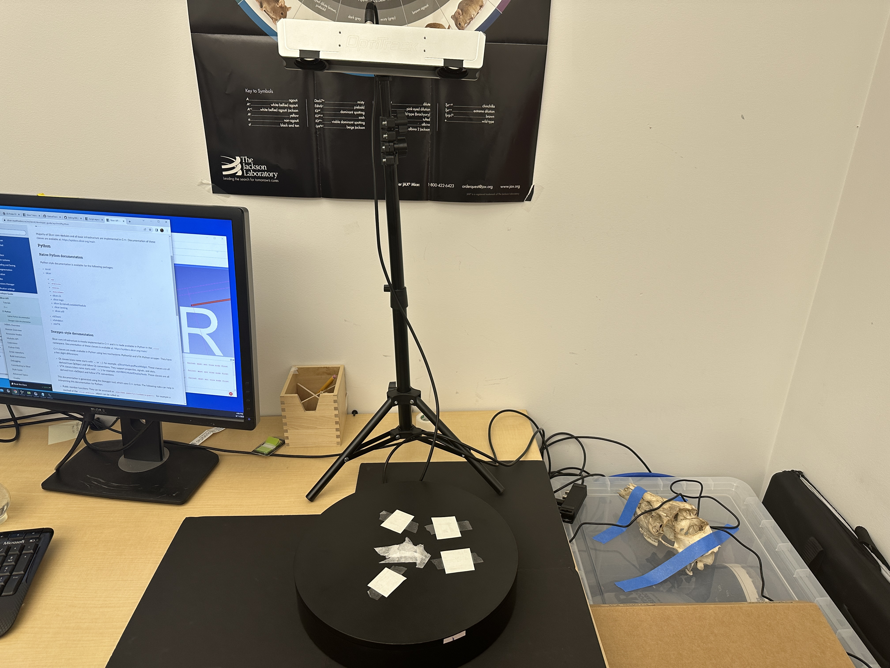
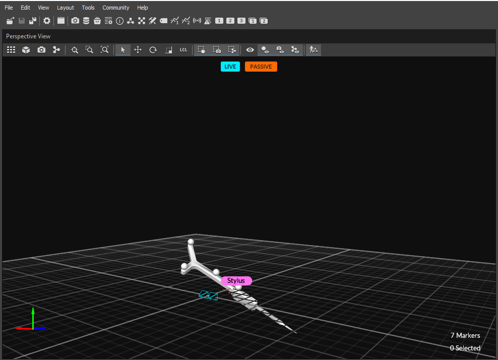
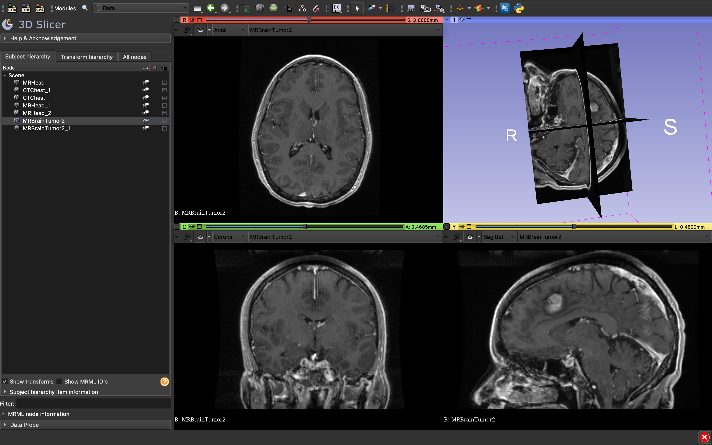

# OptiTrack Integration into 3D Slicer

## Description 

This project is an Optical Tracking system using the OptiTrack camera hardware meant to be integrated into SlicerMorph (a [*3D Slicer*](https://download.slicer.org/) extension) and replicate the functionality of old school mechanical digitizing pens with the optical tracking of a digitizing stylus. The end goal is to test the serviceability of an optical tracking system in a real medical implementation through the experimentation on accuracy and consistency, as well as to be able to programatically add markup points onto the digital reconstruction of the model through a shortcut key. 

**This project uses the [<ins>OptiTrack V120 Duo</ins>](https://optitrack.com/cameras/v120-duo/) camera system, the [<ins>Plus Toolkit</ins>](https://plustoolkit.github.io/) data pre-processing and calibration software, as well as the [<ins>Motive</ins>](https://optitrack.com/software/motive/) data processing software.**

[<ins>(*Jump to Startup Tutorial*)</ins>](#Tutorial)

# Fifth Milestone: Programming with Slicer Libraries 

## Summary

With the entire setup completed, the final step was to complete the programming aspect of the project. After going through the  

# Fourth Milestone: OptiTrack Camera Setup

## Summary

After having set up the basic components of the visualization in Slicer, it was time to create a fundamentally stable and consistent setup for the cameras. Being **infrared cameras**, the OptiTrack system works by locating markers based on the general reflectiveness of the material that is presented (explaining the reflective points on the probe itself). I created a base with *black tiles* (low reflectiveness) and a *black surface* 
(for more consistent marking) on which to mount the model and added a few reference points-made of 4 relfective bits of paper-to act as a reference object for the time being. I also mounted a non-reflective cushiony material in the middle to act as a point for *pivot* and *spin calibration* to result in a more realistic model on Slicer. 



In an ideal situation, the pieces of reflective paper would be replaced with a more professional marker material, such as the ones used on the OptiTrack probe. Since this is a very temporary setup, I decided to use a more accessible material for the time being. 

Finally, through contacting the OptiTrack support team, I managed to get a hold of the 3D model of the probe as a .PLY file and converted it to an .OBJ file for compatibility and attached it with Motive:
 

 
## Challenges

The main challenge I faced at this point was understanding how the connection between Slicer and Motive works with respect to the transforms that show up on Slicer. I discovered if the reference object was defined on Motive but not constantly presented in the shot, the correct transforms wouldn't show up in Slicer regardless of them being mentioned in the configuration files through the PLUS Server Launcher. 

# Third Milestone: Visualizing in Slicer

## Summary

At this point, after having established the connection between Motive and Slicer, I began to create a more accurate representation of the probe in Slicer's view, which calls for a 3D model of the specific probe being used ([<ins>OptiTrack Probe Kit</ins>](https://optitrack.com/accessories/measurement-tools/)). I identified the rigid body that was previously created to be a *probe* by collecting samples through the pivot calibration feature on the software, returning the (x, y, z) coordinates of the **tip** of the stylus in 3D space. With the accuracy being a key component to this project, I did some experimentation and discovered that these coordinates were accurate down to about a tenth of a millimeter (0.1 mm). 

## Challenges

At this point, I was able to correctly label and visualize the stylus through Motive's perspective view. However, the main issue I faced was being able to reach the same level of clarity in visualization in Slicer. Currently, Slicer's representation of the probe is simply a blue line with a balled tip, making it easy to see what side it the tip, but very hard to visualize the orientation at which the probe is being help with respect to the view in Slicer. The main challenge was to find the 3D model of the specific probe and place it into Slicer for a clearer visualization. 

# Second Milestone: Software & Server Connections

## Summary

In this milestone, I managed to set up the OptiTrack V120 Duo tracking camera and get it working as well as get familiar with the Motive software's less complex user interface. Once the software was up and running, I created *Rigid Body Objects* for both the stylus and a temporary reference object to be able to visualize the test objects from the perspective view to get started. I then exported the profile from Motive (.xml file) and also created my configuration file (.xml file) to get started with the PLUS Server Launcher and establish the intermediary connection between the two softwares and begin sending data to 3D Slicer. 

## Challenges

At this point, I had faced a frustrating issue with launching the server via the PLUS Server Launcher and establishing the connection to be able to send data to 3D Slicer. Having both my configuration and profile (.xml) files in the same directory, I continued to receive errors from the PLUS Server Launcher as it failed to establish the connection. Eventually I discovered that the problem was due to the live data transfer to Slicer, and that the *"Broadcast Frame"* must be toggled on through Motive to be able to do live broadcasting. The *"Broadcast Frame"* toggle can be found in Motive under View > Data Streaming Pane > *Broadcast Frame*.  

## Next Steps 

In future efforts regarding the optical tracking project, I will first begin by sending **live data** over to 3D Slicer. This way, I can begin placing basic markers and lines over several trials to test the accuracy at which the instrument performs. With this measurement of accuracy, I can then determine whether or not this is a feasable method to approach research on 3D models. Additionally, I will include a more realistic model of the stylus itself for a better and more accurate visualization through Slicer. 


# First Milestone: 3D Slicer and Markups 

## Summary

In this milestone, I worked on getting familiar with the 3D Slicer user interface (UI). Being a fairly complex software with a multitude of different modules, it is important that I first get familiar with the UI. I learned how to load sample data as well as custom data and install certain extensions which are crucial to this project (a few extensions include: **SlicerMorph**, SlicerIGT, and SlicerOpenIGTLink). Most importantly, I learned how to use the 'Markups' feature of 3D Slicer, which allows the user to add control points, connectors, and planes onto the model. This markup feature is crucial because it is very similar to what this final optical tracking project tries to replicate.

## Challenges

The main challenge I faced at this time was navigating the complexity of the 3D Slicer UI and discovering the function of the important features of Slicer. Some guidelines and tutorials that were useful to me in getting introduced to the Slicer UI and functions include the [*SlicerIGT tutorials*](https://www.slicerigt.org/wp/user-tutorial/) as well as the [*SlicerMorph tutorials*](https://github.com/SlicerMorph/Tutorials) in their documentation. SlicerMorph is more specific to my implementation, so most of their tutorials were slightly more relevant to my project. 

3D Slicer user interface example:



## Next Steps

In the following progression of this project, I will begin camera set up as well as download and start the Motive software to begin the first steps of this project. I will also install an intermediary between the tracking software (OptiTrack) and the vizualization software (Slicer); the [*PLUS Toolkit*](https://plustoolkit.github.io/) is the intermediary. 

<a id="Tutorial"></a>

# Startup Tutorial 

### 1) *Launch Motive 

*(Note: the OptiTrack camera must be receiving power before launching the software for Motive to open.)*

Once Motive is launched, you should see the rigid body object labeled "Stylus," which is the probe that is being tracked in real time. To toggle the Stylus or Reference objects on and off, locate <ins>View > Assets Pane.</ins> You can also include the 3D model of the probe through Motive by selecting the marker at the tip of the Stylus and toggling "Model Replace" within the *Properties* pane, and then attach the .OBJ file of the model through the icon next to *"Attached Geometry"*.

### 2) *Establish PLUS Connection

Launch the "Plus Server Launcher" application and navigate to the correct directory with the appropriate configuration (.xml) files and launch the server with the "Launch Server" button.

### 3) *Slicer Visualization

- Open Slicer and locate the OpenIGTLinkIF module under IGT > OpenIGTLinkIF.
- Add a connector with the "+" button.
- Check the "Active" box under "Properties."
- Move the Stylus around a little bit within the scope of the camera.
- Navigate to the I/O Configuration > IGTLConnector > IN > Click the eye to visualize the StylusToTracker transform.

### 4) Adding a New Needle Model 

- Locate IGT > Create Models and click "Create Needle."
- Go to the Data module and insert a new transform labeled "StylusTipToStylus" in the "Transform Hierarchy" tab
- Drag the new needle model into it and rename it "StylusTip." 

### 5) Pivot and Spin Calibration

- Locate IGT > Pivot Calibration
- Set INPUT as StylusToReference 
- Set OUTPUT as StylusTipToStylus
- Select "Start Pivot Calibration" and start pivoting the probe around a set point until calibration is finished.
- Select "Start Spin Calibration" and spin the probe left and right until calibration is finished.

### 6) *Adding a Tip Point (Stylus) 

- Add an empty point list Markup object (right click).
- Place the empty point list object under the transform being used to record stylus coordinates through the Transforms module (right arrow).
- Navigate to the Markups module and set the active Markups object as the empty point list (created above).
- Click the placement button (red dot with blue arrow) and place the point at the tip of the stylus in Slicer. 
- The new point should now move along with the stylus.
  
&nbsp;
&nbsp;
&nbsp;

## Important Resources

- SlicerIGT: slicerigt.org (tutorials)
- 3rd Party Tutorial: andysbrainbook.readthedocs.io (OptiTrack & Slicer)
- OptiTrack Probe Kit Guide: https://docs.optitrack.com/motive/measurement-probe-kit-guide 
- Markups code: 3D Slicer > Edit > Application Settings > SlicerMorph > Customization file
- Slicer page: slicer.readthedocs.io > Modules > Markups
- Slicer page: slicer.readthedocs.io > Developer Guide > Python > MRML / Slicer
- Slicer page: slicer.readthedocs.io > Developer Guide > Script Repository > Markups
- Probe tip coordinates (Motive): Tools > Measurement
- Add Model (Motive): Select Stylus rigid body > Properties pane > Model Replace (ON) > Attached Geometry
- Visualizing model in Slicer: Slicer > Modules > IGT > OpenIGTLinkIF > Add scene > Check "Active" box > IGTL Connector > IN > Show model 

## Important Functions

- **Get the x,y,z position of a point (vector):**
  - F_1.GetNthControlPointPositionWorld(0)

- **Place point at certain coordinates:**
  - F_1.SetNthControlPointPosition(0, vector)
- Add a control point to the current active point list:
  - slicer.modules.markups.logic().AddControlPoint()

- Add a control point to an initial location:
  - slicer.modules.markups.logic().AddControlPoint(1.0, 2.0, 3.0)


## Simple Code

```
index = 0

def function(): 
    vector = F_1.GetNthControlPointPositionWorld(0)
    F_2 = getNode("F_2")
    F_2.SetNthControlPointPosition(index, vector) 
    index += 1
```
